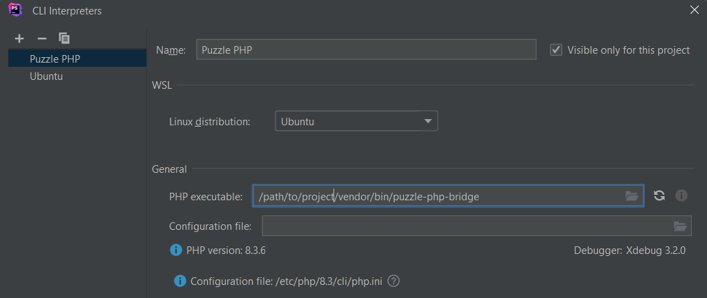
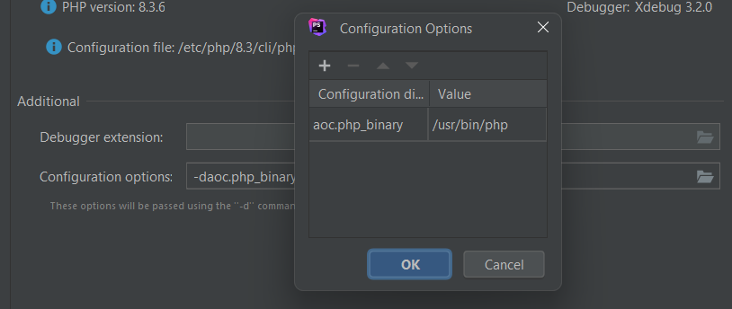
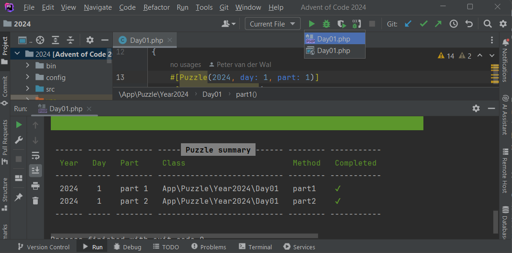

# Advent of Code CLI Bundle

## Puzzle PHP Bridge

To run your puzzle implementation directly from your IDE, the binary `vendor/bin/puzzle-php-bridge` can be used. This 
file acts as a bridge between the PHP binary and this Advent of Code CLI runner.

### Configuration in PhpStorm

Add a new CLI Interpreter and configure `/path/to/project/vendor/bin/puzzle-php-bridge` as your PHP Executable: 

Make sure to tick the "Visible only for this project" option.

#### Options

By default, this bridge file uses the PHP binary it can find within `$PATH`. To override this with a custom PHP binary,
add a configuration option with name `aoc.php_binary`:

### Run / debug your puzzle

Use the Run Current File option (or Debug Current File if you have xdebug installed) to run all puzzle implementations
in the file you have opened at that moment:

